# TPE. Blockchain - Hyperledger Fabric | 2020 - 2021

## Auteurs

| Nom | Prénom | Email |
|-|-|-|
| *Bourgeaux* | *Maxence* | *maxence.bourgeaux@etu.univ-lehavre.fr* |
| *Guyomar* | *Robin* | *robin.guyomar@etu.univ-lehavre.fr* |
| *Kacimi* | *Souhail* | *souhail.kacimi@etu.univ-lehavre.fr* |

Ce TPE reprend le travail effectué par Amine Boussoualim l'année précédente (2019 - 2020).

Son rapport est disponible
sous format PDF et son travail est disponible à l'adresse suivante : https://www-apps.univ-lehavre.fr/forge/ba160129/tpeblockchain

Lien vers le rapport Overleaf : https://www.overleaf.com/read/cgghnfrkvrmq

Lien vers la diaporama de soutenance : https://view.genial.ly/6061bc4551e3cf0ccea7054e/presentation-tpe

# I. Installer les différents logiciels

**Prérequis**

La version actuelle du projet utilise Hyperledger fabric version 2.3.1.
Il est nécessaire d'avoir une version de Node <= 14 et de Docker compose <= 1.25 pour utiliser cette version d'Hyperledger
Fabric.

Nos tests ont été effectués avec ces
versions :

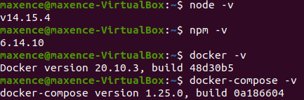

La suite du tutoriel proposera d'installer soit la version la plus récente, soit une version précise du logiciel.

**Se mettre à jour**

    sudo apt update
    sudo apt upgrade

**Installer git**

    sudo apt-get install git

**Installer cURL**

    sudo apt install curl

**Installer la dernière version de Node.js et npm**

    sudo apt install nodejs
    sudo apt install npm

**Installer une version précise de Node.js (en utilisant NVM)**

    curl -o- https://raw.githubusercontent.com/creationix/nvm/v0.33.11/install.sh | bash

Il faut ensuite copier la commande présente dans le terminal, puis le fermer et le réouvrir. Vérifiez que
l'installation s'est bien effectuée :

    nvm --version

Puis regardez les différentes versions existantes et installez celle désirée (ici 14.15.4) :

    nvm ls-remote
    nvm install 14.15.4

**Docker et Docker Compose**

Installer la version la plus récente de Docker :

    sudo apt install docker-ce

Installer une version précise de Docker (pour une autre version, il suffit de changer 1.25.0 par la version désirée) :

    sudo curl -L "https://github.com/docker/compose/releases/download/1.25.0/docker-compose-$(uname -s)-$(uname -m)" -o /usr/local/bin/docker-compose

Changez les permissions :

    sudo chmod +x /usr/local/bin/docker-compose

Assurez-vous que le démon docker est en cours d'exécution :

    sudo systemctl start docker

Facultatif : si vous souhaitez que le démon docker démarre au démarrage du système, exécutez la commande suivante :

    sudo systemctl enable docker

Ajoutez votre utilisateur au groupe Docker :

    sudo usermod -a -G docker <username>

**Hyperledger Fabric**

Placez-vous dans le répertoire de votre choix et installer Hyperledger Fabric :

    curl -sSL https://bit.ly/2ysbOFE | bash -s

Ajoutez au fichier .bashrc la ligne suivante pour ajouter les variables d'environnement :

    export PATH=${PWD}/../bin:$PATH

Vous devez également définir le FABRIC_CFG_PATH :

    export FABRIC_CFG_PATH=$PWD/../config/

# II. Test du réseau Fabric

**Réseau de test**

Accédez au répertoire réseau de test :

    cd fabric-samples/test-network

Supprimez tous les conteneurs ou artefacts de toutes les exécutions précédentes :

    ./network.sh down

Activez le réseau :

    ./network.sh up

Cela va créer un réseau de deux nœuds pairs (peer nodes) et d'un nœud commandeur (ordering node). Les nœuds pairs sont
les composants essentiels d'un réseau Fabric. Ce sont ces nœuds qui stockent le registre de la blockchain et valident
les transactions avant que le registre ne soit modifié.

Vous allez pouvoir voir ces nœuds avec la prochaine commande.

**Les composants du réseau de test**

Affichez tous les conteneurs Docker qui s'exécutent sur votre ordinateur :

    docker ps -a

Vous devriez avoir un résultat similaire à :

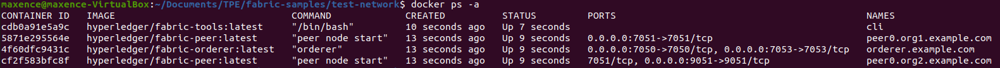

Chaque nœud pair qui interagit avec le réseau doit appartenir à une organisation différente (org1, org2 ...). Le nœud
commandeur est celui qui va maintenir et diriger l'ordre des transactions du réseau.
Ce réseau de test créé ne dispose cependant d'aucune chaîne entre les différents nœuds.

# III. Fonctionnement du TPE 2020 - Vente d'un véhicule

**Créer le réseau**

Déplacez le répertoire VenteVoiture vers fabric-samples, puis ouvrez-le :

    cd fabric-samples/VenteVoiture

Exécutez le script pour démarrer le réseau de tests :

    ./network-starter.sh

Network-starter va d'abord exécuter la commande ./network.sh down afin de supprimer tout ce qui serait resté des exécutions
précédentes, puis va lancer la commande ./network.sh up createChannel -ca -s couchdb afin de créer un réseau de deux nœuds
pairs reliés entre eux et gérés par couchdb (Apache CouchDB est un système de gestion de base de données). L'option "-ca"
signifie "Certificate Authorities" et permet à chaque nœud d'avoir sa propre certification et ils partagent la même racine
de confiance. Le CA nous permet aussi de créer un certificat et une clé privée pour nos applications.

Lorsque le script est terminé, vous pouvez voir les nœuds Fabric s'exécutant sur votre machine :

    docker ps

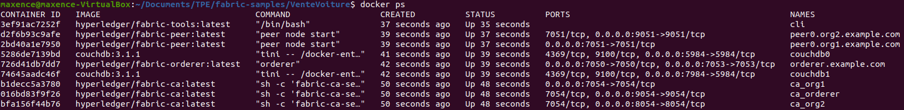

**Installer et approuver le contrat intelligent**

**(Alice)** Ouvrez un premier terminal et accédez au répertoire de la 1ère personne Alice :

    cd fabric-samples/VenteVoiture/organization/Alice

**(Alice)** Optionnel : Exécutez la commande suivante pour démarrer Logspout ("Logspout est un routeur de journaux open
source conçu spécifiquement pour les journaux de conteneurs Docker. Il collecte les journaux de tous les autres conteneurs
fonctionnant sur le même hôte, puis les transmet à une destination de votre choix") :

    ./monitordocker.sh net_test

**(Alice)** Ouvrez un nouveau terminal si vous avez fait l'étape optionnelle, sinon exécutez le script pour définir les
variables d'environnement :

    source alice.sh

**(Alice)** Optionnel : Pour vérifier que vous pouvez bien utiliser Fabric Command Line Interface (CLI), exécutez la commande :

    peer version

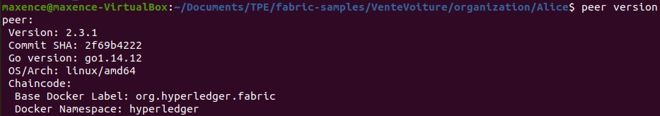

**(Alice)** Créez le package du chaincode (Archive le contrat intelligent en chaincode et l'écrit dans un fichier) :

    peer lifecycle chaincode package car.tar.gz --lang node --path ./contract --label car_0

Cette commande va créer une archive nommée car.tar.gz. L'option --lang spécifie le langage de la chaincode, --path permet
de donner le chemin vers le contrat intelligent et --label permet de créer un label servant à identifier le chaincode après
son installation.

**(Alice)** Installez le chaincode au nœud :

    peer lifecycle chaincode install car.tar.gz

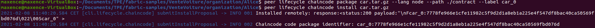

Le contrat intelligent est désormais installé !

**(Alice)** Obtenez le packageID du chaincode pour ensuite approuver la définition du chaincode :

    peer lifecycle chaincode queryinstalled

**(Alice)** Enregistrez l'ID du package en tant que variable d'environnement :

    export PACKAGE_ID=car_0:7778fe966e1cfe11982c5f9d2d1a8eb1a225e4f547df8bac40ca50569fbd076d

**(Alice)** Approuvez la définition du chaincode pour l'organisation (for my organization):

    peer lifecycle chaincode approveformyorg --orderer localhost:7050 --ordererTLSHostnameOverride orderer.example.com --channelID mychannel --name carcontract -v 0 --package-id $PACKAGE_ID --sequence 1 --tls --cafile $ORDERER_CA

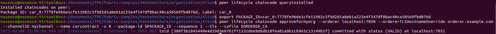

On va maintenant faire la même chose pour Bob, c'est à dire installer et approuver le contrat de son côté.

**(Bob)** Ouvrez un second terminal et accédez au répertoire de la 2ème personne Bob :

    cd TPEBlockchain/VenteVoiture/organization/Bob

**(Bob)** Exécutez le script pour définir les variables d'environnement :

    source bob.sh

**(Bob)** Créez le package du chaincode (Archive le contrat intelligent en chaincode et l'écrit dans un fichier) :

    peer lifecycle chaincode package car.tar.gz --lang node --path ./contract --label car_0

**(Bob)** Installez le chaincode au nœud :

    peer lifecycle chaincode install car.tar.gz

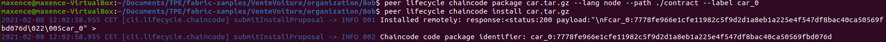

**(Bob)** Obtenez le packageID du chaincode :

    peer lifecycle chaincode queryinstalled

**(Bob)** Enregistrez l'ID du package en tant que variable d'environnement :

    export PACKAGE_ID=car_0:7778fe966e1cfe11982c5f9d2d1a8eb1a225e4f547df8bac40ca50569fbd076d

**(Bob)** Approuvez la définition de la chaincode du contrat :

    peer lifecycle chaincode approveformyorg --orderer localhost:7050 --ordererTLSHostnameOverride orderer.example.com --channelID mychannel --name carcontract -v 0 --package-id $PACKAGE_ID --sequence 1 --tls --cafile $ORDERER_CA

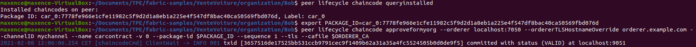

**(Alice)** Retournez sur le terminal correspondant à Alice et validez la définition du chaincode :

    peer lifecycle chaincode commit -o localhost:7050 --ordererTLSHostnameOverride orderer.example.com --peerAddresses localhost:7051 --tlsRootCertFiles ${PEER0_ORG1_CA} --peerAddresses localhost:9051 --tlsRootCertFiles ${PEER0_ORG2_CA} --channelID mychannel --name carcontract -v 0 --sequence 1 --tls --cafile $ORDERER_CA --waitForEvent

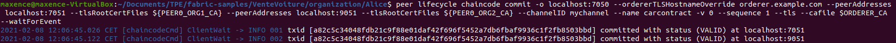

Vous pouvez à tout moment vérifier que tout se passe correctement grâce au terminal où la commande ./monitoring net_test
a été effectuée.

**Vente de la voiture**

**(Alice)** Accédez au répertoire application :

    cd application

**(Alice)** Installez les dépendances du contrat intelligent (cela va prendre un peu de temps ~ 1 min) :

    npm install

**(Alice)** Si des vulnérabilités sont présentes :

    npm audit fix

**(Alice)** Ajoutez des informations au portefeuilles (Wallet) :

    node addToWallet.js

**(Alice)** Mettez en vente la voiture :

    node sell.js

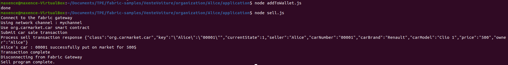

**(Bob)** Retournez sur le terminal correpondant à Bob et accédez au répertoire application :

    cd application

**(Bob)** Installez les dépendances du contrat intelligent (cela va prendre un peu de temps ~ 1 min) :

    npm install

**(Bob)** Si des vulnérabilités sont présentes :

    npm audit fix

**(Bob)** Modifiez l'état de la voiture :

    node addToWallet.js

**(Bob)** Achetez la voiture :

    node buy.js

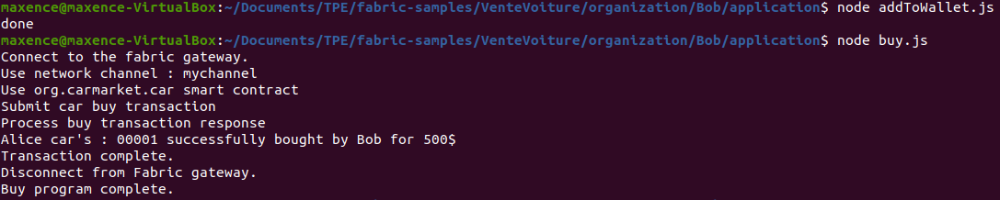

**(Bob)** Constatez que le véhicule a bien changé de propriétaire :

    node info.js

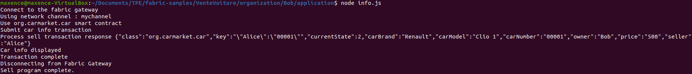

**Sources**

Pour plus de renseignements ou si des difficultés sont rencontrées, voici le lien vers la documentation
d'Hyperledger Fabric :

https://Hyperledger-fabric.readthedocs.io/en/latest/tutorial/commercial_paper.html

# IV. Hyperledger Explorer

Hyperledger Explorer est un outil open source simple, puissant, facile à utiliser et bien entretenu pour parcourir l'activité sur le réseau blockchain.
Hyperledger Explorer fonctionne seulement sur MacOS et Ubuntu.

**Configurer Hyperledger Explorer**

La dernière version d'Hyperledger Explorer fonctionne avec la version 2.2 d'Hyperledger Fabric, si vous utilisez une autre version d'Hyperledger Fabric vous pourrez rencontrer des problèmes.
Vous pouvez consulter les dernières mises à jour d'Hyperledger Explorer sur le lien suivant : [Hyperledger Explorer](https://github.com/Hyperledger/blockchain-explorer).
Si vous voulez installer la version 2.2, utilisez la commande suivante :

    curl -sSL https://bit.ly/2ysbOFE | bash -s -- 2.2.2

Avant de continuer, il se peut qu'il y ait des problèmes de droits qui vous empêcheront d'utiliser le projet. Pour y remédier, il suffit de taper cette commande :

    sudo chmod -R 700 /home/<your-username>/<path-to-tpe-blockchain-Hyperledger>

Cette commande donne tous les droits (lecture, écriture et exécution) uniquement pour le propriétaire.

Il faut ensuite déployer le réseau avant de lancer Hyperledger Explorer. Pour cela, il suffit d'exécuter les commandes ci-dessous :

    cd tpe-blockchain-Hyperledger/VenteVoiture/

    ./network-starter.sh

    cd ../test-network/

    ./network.sh deployCC -ccn carcontract -ccp ../VenteVoiture/organization/Alice/contract -ccl javascript

Cette commande est un raccourci de toutes les commandes `peer` utilisées lors du tuto sur le fonctionnement du TPE (étape III). `../VenteVoiture/organization/Alice/contract` est le path du smart contract, on pourrait aussi utiliser celui de Bob par exemple.

    cd ../explorer/

    docker-compose up -d

Il est essentiel de se situer dans le dossier explorer pour lancer la commande `docker-compose up -d`.

Maintenant que tout est prêt, ouvrez votre navigateur à l'adresse http://localhost:8080/

Si une page login s'ouvre :
  * User : admin
  * Password : adminpw

Ces identifiants sont modifiables via le fichier `test-network.json` situé dans `/tpe-blockchain-Hyperledger/explorer/connection-profile` aux lignes 6 et 7.

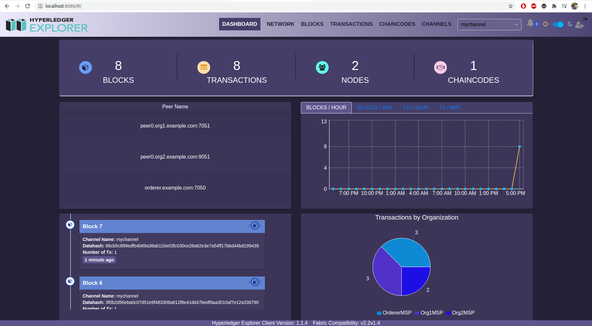

Et voilà, vous avez réussi à faire fonctionner Hyperledger Explorer !

Enfin pour l'arrêter et fermer tout proprement, tapez :

    docker-compose down -v

    cd ../VenteVoiture/

    ./network-clean.sh

# V. Application de vente de voitures sécurisée

Cette partie du tuto va reprendre tout ce qui a été vu jusqu'à présent, et permettre la mise en place d'une application web
facilitant l'utilisation de la blockchain Hyperledger Fabric.

Pour cela, nous avons besoin d'installer Nodemon :

    npm install -g nodemon

Nous allons aussi procéder à l'installation de dépendances à plusieurs reprises :

    npm install

Si jamais des vulnérabilités sont détectées après une utilisation de cette commande, il faudra faire cette commande :

    npm audit fix

**Déploiement du réseau**

Nous allons déployer le réseau de la même manière que dans la partie précédente. Pour cela, il faut ouvrir un terminal et se diriger dans le dossier *VenteVoiture* :

    cd tpe-blockchain-hyperledger/VenteVoiture/

Pour éviter toute erreur de clé liée à Hyperledger Explorer, il est recommandé de commencer par exécuter le script suivant :

    ./network-clean.sh

Ensuite, nous pouvons déployer le réseau :

    ./network-starter.sh

    cd ../test-network/

    ./network.sh deployCC -ccn carcontract -ccp ../VenteVoiture/organization/Alice/contract -ccl javascript

**Déploiement de l'application Web**

Nous allons maintenant déployer l'application Web qui va grandement nous aider pour l'interaction avec la blockchain Hyperledger Fabric. Pour cela, il faut se diriger dans le dossier *Server* de *VenteVoiture* pour lancer le serveur avec Nodemon :

    cd ../VenteVoiture/organization/Server

    npm install

On lance le serveur (qui va utiliser le port 3001) :

    nodemon ./server.js

Nous allons ensuite déployer la page Web d'Alice et de Bob. Pour cela, on ouvre un nouveau terminal et on effectue les commandes suivantes :

**(Alice)**

    cd tpe-blockchain-hyperledger/VenteVoiture/organization/Alice/application

    npm install

**(Alice)**

    cd AddToWallet/

    npm install

    node addToWallet.js

**(Alice)**

    cd ../App/

    npm install

**(Alice)**  Et on lance l'application, ce qui a pour effet d'ouvrir une page web à l'adresse http://localhost:3000 :

    npm start

Nous allons maintenant passer à Bob. Nous allons effectuer exactement les mêmes commandes, mais dans le dossier de Bob et dans un nouveau terminal :

**(Bob)**

    cd tpe-blockchain-hyperledger/VenteVoiture/organization/Bob/application/

    npm install

**(Bob)**

    cd AddToWallet/

    npm install

    node addToWallet.js

**(Bob)**

    cd ../App/

    npm install

**(Bob)** On lance l'application, ce qui a pour effet d'ouvrir une page web comme pour Alice mais à l'adresse http://localhost:3002 :

    npm start

Le terminal nous demande si l'on veut exécuter le programme sur un autre port. On répond simplement oui en écrivant *y*.

Nous avons désormais nos deux pages Web ouvertes, qui représentent les portefeuilles d'Alice et Bob. Il faut maintenant ouvrir Hyperledger Explorer. Dans un nouveau terminal :

    cd tpe-blockchain-hyperledger/explorer/

    docker-compose up -d

Une fois ces commandes effectuées, on retrouve Hyperledger Explorer à l'adresse http://localhost:8080/. Si jamais Hyperledger Explorer s'ouvre à l'adresse http://localhost:8080/#/, il faudra alors retirer le *#* et rafraichir la page. Cela ouvrira une page demandant de s'identifier. Les identifiants restent les mêmes que dans la partie précédente :
  * User : admin
  * Password : adminpw

Enfin, si Hyperledger Explorer ne s'ouvre pas, cela est dû à une erreur de clé dans le fichier *test-network.json* situé ici :

    cd tpe-blockchain-hyperledger/explorer/connection-profile

Dans ce cas, il faudra exécuter *network-clear.sh* situé ici :

    cd tpe-blockchain-hyperledger/VenteVoiture/

Ce script nettoie le réseau déployé, et en même temps réinitialise la clé du fichier *test-network.json*. Si jamais, une fois ce script exécuté, l'erreur persiste, il faudra alors aller à la ligne 32 pour remplacer la fin du *path* du bloc *organizations* :

    "path": "/tmp/crypto/peerOrganizations/org1.example.com/users/Admin@org1.example.com/msp/keystore/une_suite_de_nombre_sk"

par

    "path": "/tmp/crypto/peerOrganizations/org1.example.com/users/Admin@org1.example.com/msp/keystore/Key_sk"

Malheureusement, il faudra redéployer le réseau, et refaire les commandes précédentes.

Comme pour la partie précédente, si l'on veut arrêter le programme, il faut exécuter dans le dernier terminal (celui qui a ouvert Hyperledger Explorer) :

    docker-compose down -v

    cd ../VenteVoiture/

    ./network-clean.sh

Pour les autres terminaux, on pourra les fermer avec les touches *Ctrl + c*.

**Fonctionnalités**

Voici une image de setup possible pour utiliser facilement et efficacement notre projet. Les pages web étant faites grâce à React, elles se mettent à jour automatiquement lors d'un changement. Dans cette configuration, si un changement est effectué, on pourra directement le voir sur les 3 pages.

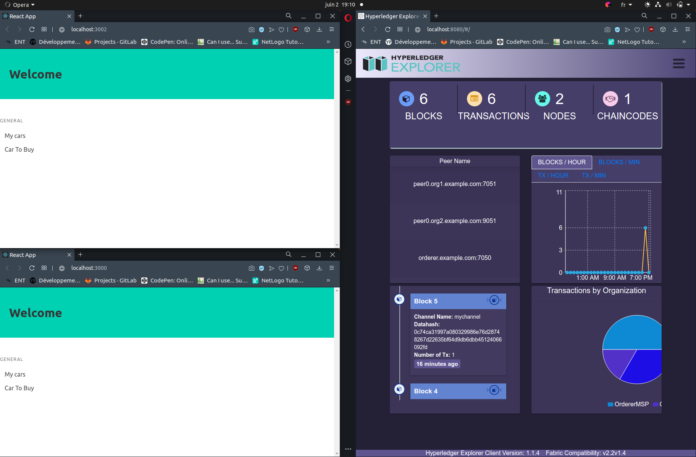

Nous avons déjà vu Hyperledger Explorer dans la partie précédente, nous allons donc nous attarder cette fois-ci sur les pages Web représentant le portefeuille d'Alice et de Bob.

Si l'on clique sur l'onglet *My cars*, on obtient la liste des voitures qu'Alice possède ainsi qu'un bouton permettant l'ajout d'autres voitures, le tout dans une nouvelle url. On peut donc essayer d'ajouter une voiture et voir ce qu'il se passe :

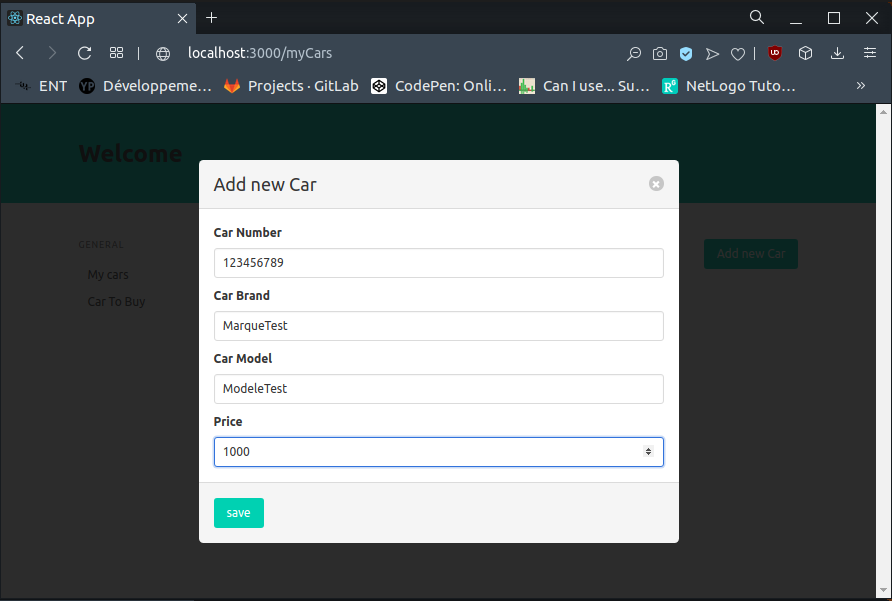

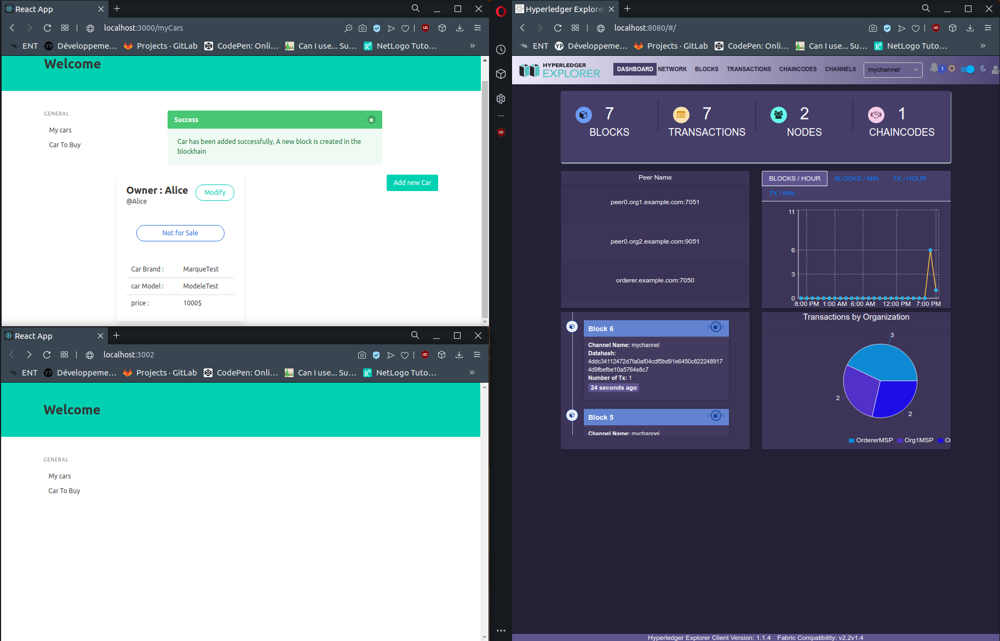

On peut facilement remarquer l'ajout de la voiture du côté d'Alice grâce à une notification qui apparaît, ainsi que la mise à jour d'Hyperledger Explorer sur la blockchain (nouveau bloc et nouvelle transaction).

On peut ensuite mettre la voiture d'Alice en vente en cliquant sur *Not for Sale*. On clique ensuite sur *Car To Buy* du côté de Bob et on regarde ce qu'il s'est passé :

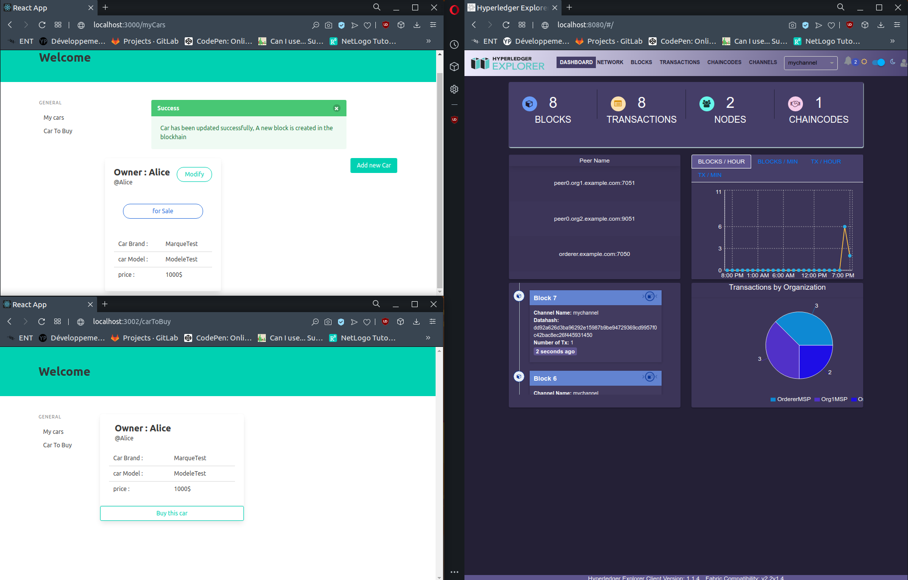

On constate que la voiture qu'Alice mise en vente est désormais présente dans la liste des voitures à acheter du côté de Bob, et la blockchain a bien été mise à jour du côté d'Hyperledger Explorer. On peut évidemment aller chercher plus d'informations du côté d'Hyperledger Explorer via les onglets *Blocks* et *Transactions*.

Pour finir, regardons comment se passe l'achat de la voiture d'Alice par Bob :

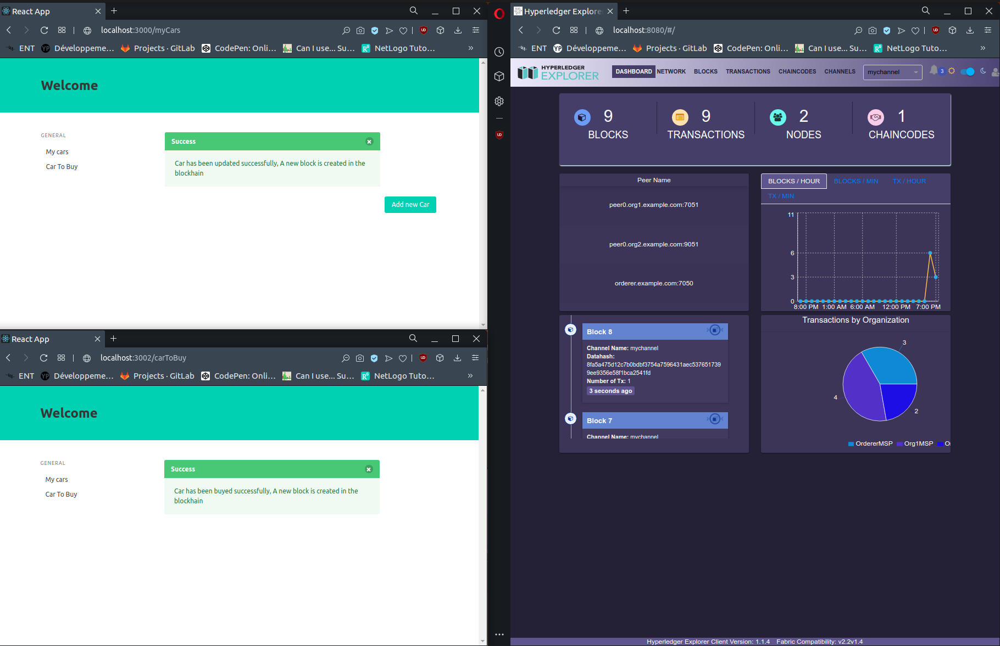

Bob a bien acheté la voiture, que l'on retrouvera dans son onglet *My cars*, tandis que du côté d'Alice la voiture a disparue. Hyperledger Explorer quant à lui a bien été mis à jour.
